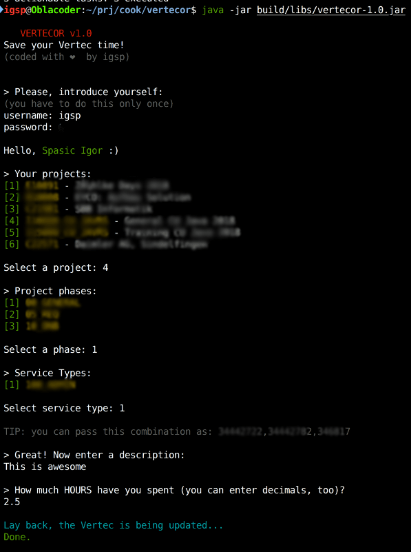
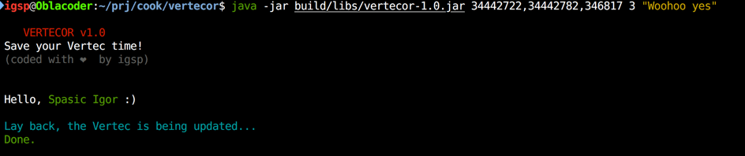

# VERTECOR v1.0

> Would you like to enter your logs in the Vertec faster? 

## Usage

Download the `jar` from the [releases](https://github.com/igr/vertecor/releases) and run it:

```bash
java -jar vertecor-1.0.jar
```

There are 2 ways how you can use it: _Interactive mode_ and _The Fast mode_.

### Interactive mode

This is the default mode. Program will ask for all the data. Here is an example:



### The Fast mode

You can pass all data from the command line. Notice the `TIP` message from above screen! Here is an example:



## Some things to be aware of

+ We cache entries. We fetch them very first time and cache locally. This improves the speed. To invalidate the cache, just add the `--nocache` argument.
+ We store user/password in the cache folder, too, in plaintext.
+ Cache folder is located at `~/.vertec`.
+ Compiled on Java8.
+ This was coded in couple of hours.
+ No idea how it looks on Windows :)

## Development notes

It's easy to build:

```bash
./gradlew clean jar
```

## License

BSD-2