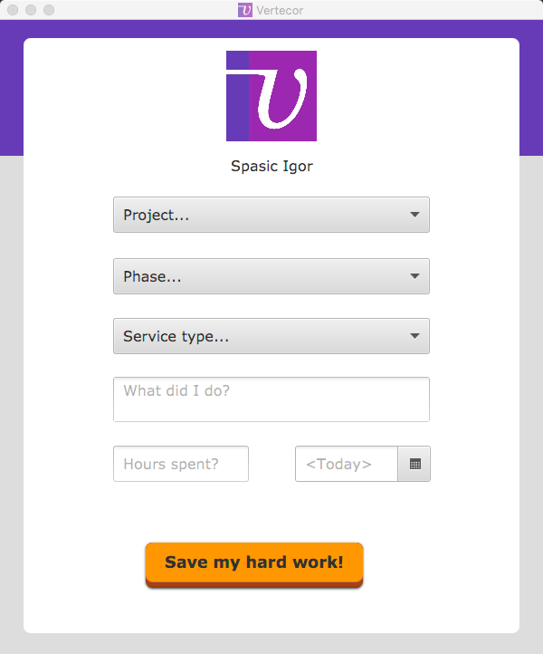

# VERTECOR v2.0.1

> Who likes faster Vertec? 

## Usage

Download the `jar` from the [releases](https://github.com/igr/vertecor/releases) and run it. You can use it in the CLI or with the GUI. 

### GUI mode

If you don't like command line then just run the GUI:

```bash
java -jar vertecor.jar --ui
```

It's just GUI. It's self-explanatory. 



### CLI mode

This is the default mode, when no argument is provided:

```bash
java -jar vertecor.jar
```

The **Vertecor** is user friendly: if you don't specify arguments in the command line, it will ask for it. So, you don't have to pass anything; just run the program. However, you may speed up and automate the process by passing few or all required arguments.

**Vertecor** will now aks for all the data. Something like this:


## Program arguments

You can optionally pass one or more arguments from CLI:

Options are:

+ `--ui` - runs the UI.
+ `--nocache` - ignores local cache. _No cache_ will be created or consumed, everything will be (slowly) fetched from the server.
+ `--clearcache` - clears the cache _before_ the execution. New cache will be created.
+ `-d | --date <date>` - the date in ISO format (`yyyy-MM-dd`).
+ `-m | --message <message>` - specifies the description
+ `-h | --hours <hours>` - the decimal amount of spent hours

There are 3 parameters:

```
<project-phase-type> [<hours> [<message>]]
```

Parameters are:

+ `project-phase-type` - comma-separated IDs for the project, phase and/or service type (notice the `TIP` on above screenshot!)
+ `hours` - decimal value for spent hours
+ `message` - description

You may specify _anything_ you want, everything is optional. The **Vertecor** will ask for anything not provided.

## Usage Examples

Run the gui:

```bash
java -jar vertecor.jar --ui
```

Run the gui without any cache:

```bash
java -jar vertecor.jar --ui --nocache
```

Use the CLI and specify date and hours; ask for project information and a message:

```bash
java -jar vertecor.jar -d 2018-06-15 -h 2.5
```

Use the CLI and set everything in command line, don't ask for anything more:

```bash
java -jar vertecor.jar 111,222,333 2.5 "Awesome work"
```

Use the CLI and clears the cache, pass the hours and description, ask for the project:

```bash
java -jar vertecor.jar -h 1.5 -m "Good job" --clearcache
```

You get the point :)

## Some things to be aware of

+ Project related entries are **cached**. They are fetched very first time and cached locally. This improves the speed. To invalidate the cache, just pass the `--clearcache` option.
+ Cache can be ignored by passing `--nocache` option.
+ Username & password in stored in the cache folder, too, in plaintext. Yeah.
+ Cache folder is located at `~/.vertec`.
+ Works on Java8.
+ You need UTF8 font in console.

## Development notes

It's easy to build:

```bash
./gradlew clean jar
```

Disclaimer: I made this project to learn German. Please do not use it to enter Vertec times.

## License

BSD-2